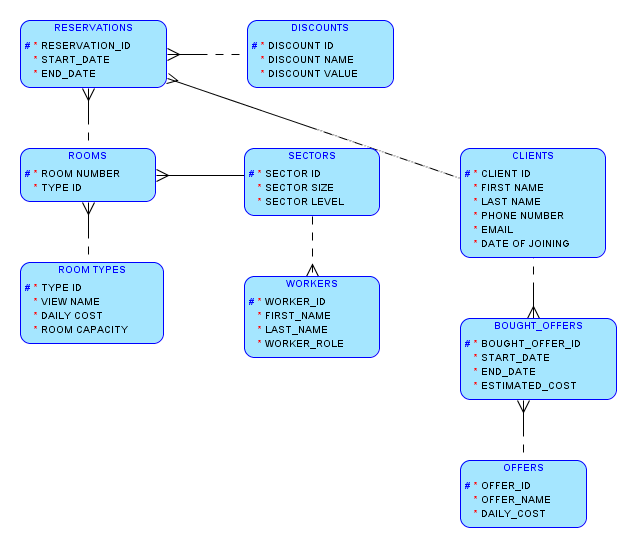

# Baza danych do obsługi hotelu

## Opis

Baza danych realizuje obsługę klientów w hotelu. Klient ma możliwość:

* Wynajęcia pokoju: klient ma możliwość wyboru pokoju dowolnego typu, o ile jest on w danym terminie wolny.

* Wynajęcia usługi dodatkowej (np. roweru, kolacji, motorówki).

* Wykorzystania zniżki przy wynajmowaniu pokoju (zniżki nie łączą się).

Ponadto:

* Pokoje są pogrupowane w sektory, które są obsługiwane przez pracowników. Każdy pokój ma określony typ dzięki czemu łatwiej jest znaleźć wolne miejsce dla gościa.

* Klientom przysługują zniżki, które mogą wynikać z bycia stałym gościem lub z innych indywidualnych powodów.

Baza też umożliwia obliczenie całkowitego przychodu ze sprzedaży pokoi oraz ofert, bezkolizyjne dokonywanie rezerwacji czy znalezienie najkorzystniejszej zniżki dla danego klienta.

## Zmiany względem pierwotnej koncepcji

Niektóre elementy z pierwotnej koncepcji zostały zmienione, między innymi:

* Procedura `ASSIGN_DISCOUNT` - została zastąpiona funkcją `GET_DISCOUNT_ID`, która pozwala uzyskać proponowaną zniżkę bez jej przypisywania.

* Wyzwalacz sprawdzający prawidłowość rezerwacji został zastąpiony funkcją `IS_RESERVATION_VALID`, która może być użyta w różnych kontekstach (nie tylko przy wstawianiu/zmienianiu rekordu).

* Wyzwalacz sprawdzający czy sektor ma obsługę został usunięty. Obsługa sektorów nie jest istotna dla tej bazy danych (wymagałoby to stworzenie dodatkowego grafiku pracowników i innych tabel co zdecydowanie skomplikowałoby bazę). Zamiast tego pojawił się wyzwalacz zliczający ilość pokojów dla każdego sektora, co w przyszłości może pozwolić na efektywniejszą implementację grafiku pracowników.

## Możliwości dalszego rozwoju

W przyszłości baza mogłaby dodatkowo obsługiwać grafik pracowników wykorzystując już istniejące tabele `SECTORS` i `WORKERS` (ta tabela mogłaby być rozszerzona o dodatkowe kolumny pozwalające na lepszą identyfikację pracownika).

## Katalogi

* `/script` - katalog zawierający wszystkie skrypty budujące bazę danych (wraz z opisami w plikach `readme.md`).
* `/tests` - katalog zawierający pliki testujące funkcjonalności zaimplementowane w bazie danych (wraz z opisami w plikach `readme.md`).
* `/pics` - katalogi zawierające obrazy dla plików `.md`.

## Analiza rozwiązania

### Model ER

### Model relacyjny

### Tabele

* `CLIENT` to tabela przechowująca klientów i ich dane kontaktowe.
* `RESERVATIONS` to tabela przechowująca terminy rezerwacji i przewidywany koszt. Tabela ta stanowi "łącznik" między klientami a pokojami. Tutaj też dodawane są promocje na wynajem pokoju.
* `DISCOUNTS` to tabela przechowująca zniżki. Będą to zniżki wynikające z bycia np. stałym klientem lub bycia pracownikiem firmy partnerskiej.
* `ROOMS` to tabela przechowująca numer pokoju.
* `ROOM_TYPES` to tabela przechowująca informacje o typie pokoju, np. czy jest to pokój z widokiem.
* `SECTORS` to tabela grupująca pokoje w sektory. Ma to ułatwić przydzielanie pracowników do obsługi danych pokoi (np. 5 pracowników będzie obsługiwało dany segment).
* `WORKERS` to tabela przechowująca pracowników, których zadaniem jest utrzymanie pokojów w czystości.
* `OFFERS` to tabela przechowująca dodatkowe oferty, które klient może opcjonalnie nabyć (na oferty zniżki nie przysługują), np. karnet do sauny, rower, śniadanie w hotelu.
* `BOUGHT_OFFERS` to tabela łącząca klientów z kupionymi przez nich ofertami.

### Wyzwalacze

* `ADD_DOJ_FOR_CLIENT_TRIGGER` to wyzwalacz ustawiający datę dołączenia klienta na aktualną datę systemową.
* `RESERVATIONS_AUTOINCR` to wyzwalacz implementujący klucz autoinkrementowany dla tabeli `RESERVATIONS`.
* `RESERVATIONS_ESTIMATED_COST` to wyzwalacz obliczający przewidywany koszt końcowy rezerwacji. Jego uruchomienie zależy nie tylko od wstawienia nowej rezerwacji, kiedy to koszt jest obliczany po raz pierwszy, ale również od zmiany długości rezerwacji.
* `BOUGHT_OFFERS_AUTOINCR` to wyzwalacz implementujący klucz autoinkrementowany dla tabeli `BOUGHT_OFFERS`.
* `BOUGHT_OFFERS_ESTIMATED_COST` to wyzwalacz obliczający przewidywany koszt końcowy wynikający z wykorzystania oferty. Uruchamiany jest po raz pierwszy przy zakupie oferty oraz ewentualnie później przy zmianie czasu korzystania z oferty.
* `SECTOR_SIZE_CONTROL` to wyzwalacze obliczające rozmiar sektora w zależności od tego, ile pokoi się w nim znajduje. Wyzwalany jest w momencie dodania nowego pokoju - pokoje z założenia nie znikają (`DELETE` nie zostanie wykonane) oraz nie zmieniają położenia (`UPDATE` też nie zostanie wykonane).

### Procedury

* `HOTEL.RESERVE` to procedura rezerwująca pokój w zależności od preferencji klienta. Argumenty:
  * `ARG_CLIENT_ID` - identyfikator klienta, dla którego będziemy rezerwować pokój.
  * `ARG_ROOM_TYPE` - identyfikator typu pokoju. Procedura znajdzie pokój danego typu wśród dostępnych i przydzieli go klientowi.
  * `ARG_START_DATE` - początek rezerwacji.
  * `ARG_END_DATE` - koniec rezerwacji.
  * `ARG_DISCOUNT_ID` - identyfikator zniżki, która będzie przydzielona klientowi. Argument może mieć wartość `NULL`, wtedy zostanie przypisana zniżka domyślna.
* `HOTEL.BUY_OFFER` to procedura przydzielająca klientowi ofertę. Argumenty:
  * `ARG_CLIENT_ID` - identyfikator klienta, któremu będzie przydzielona oferta.
  * `ARG_OFFER_ID` - identyfikator oferty, która będzie przydzielona.
  * `ARG_START_DATE` - początek rezerwacji.
  * `ARG_END_DATE` - koniec rezerwacji.

### Funkcje

* `IS_RESERVATION_VALID` to funkcja testująca czy jest możliwość zarezerwowania konkretnego pokoju w określonym terminie. Sprawdza ona, czy podana rezerwacja nie pokrywa się z innymi. Argumenty:
  * `ARG_ROOM_NUMBER` - numer sprawdzanego pokoju.
  * `ARG_START_DATE` - początek hipotetycznej rezerwacji.
  * `ARG_END_DATE` - koniec hipotetycznej rezerwacji.
* `CALCULATE_MONTHLY_INCOME` to funkcja obliczająca przychód wynikający z wynajmowania pokoi i sprzedaży różnych ofert. Argumenty `MONTH_NUMBER` i `YEAR_NUMBER` określają dla którego miesiąca obliczyć przychód.
* `GET_DISCOUNT_ID` to funkcja sprawdzająca czy danemu klientowi można przydzielić automatyczną zniżkę, czyli taką która wynika z bycia stałym klientem.

### Wykorzystanie kursorów

Z kursorów korzysta funkcja `IS_RESERVATION_VALID` oraz procedura `RESERVE`.