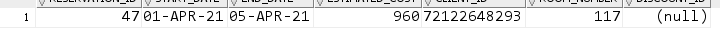
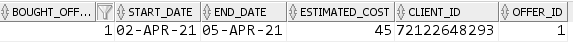
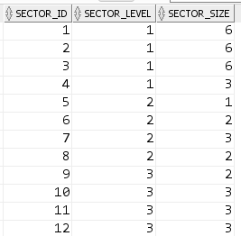

# Testy wyzwalaczy

## `ADD_DOJ_FOR_CLIENT`

Efekt wywołania testu w dniu `04.06.2020`:

## `RESERVATIONS_ESTIMATED_COST`

Efekt wywołania testu:

Przewidywany koszt za 4 dni pobytu jednej osoby został wyliczony na 960zł.

Zgodnie z cennikiem dzień pobytu w pokoju 117 kosztuje 240zł, czyli za 4 dni pobytu zapłacimy 960zł (wszystko zostało prawidłowo policzone).

## `BOUGHT_OFFERS_ESTIMATED_COST`

Efekt wywołania testu:

Przewidywany koszt został wyliczony na 45zł.

Zgodnie z cennikiem dzień wykorzystywania oferty "1" kosztuje 15zł, czyli za 3 dni korzystania z oferty zapłacimy 45zł (wszystko zostało prawidłowo policzone).

## `SECTOR_SIZE_CONTROL`

Przy dodawaniu pokoi do bazy danych zadziałał właśnie ten wyzwalacz. Zadziałał on prawidłowo:

## Pozostałe wyzwalacze

Pozostałe wyzwalacze też działają prawidłowo, pokazują to chociażby poprzednie testy (klucz autoinkrementowany zadziałał prawidłowo).